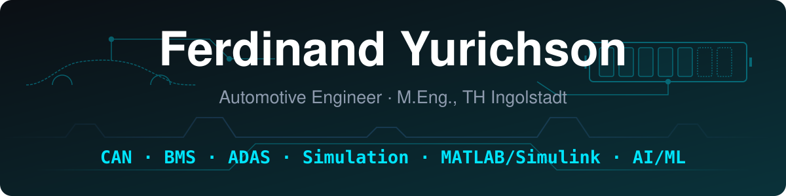

I am a **Master's Engineering Student at Technische Hochschule Ingolstadt (THI)** working at the intersection of **automotive systems, intelligent software, and modern control engineering**. 

My engineering focus spans **Automotive & Mobility, EV Battery Management Systems (BMS), ADAS, Vehicle Dynamics, CAN/OBD-II Diagnostics, and MATLAB/Simulink simulation**. Beyond automotive applications, I build solutions involving **AI/ML, image recognition/computer vision, and intelligent heating systems**.

---

## 🛠️ Toolbox

### Core Stack

### Protocols & Hardware Testing

---

## 🚀 Projects

### Automotive, Mobility & Battery Systems

<table>
<tr>
<td width="50%" valign="top">
<b><a href="https://github.com/yourusername/vcan-ecu-telemetry-dashboard">vCAN ECU Telemetry Dashboard</a></b> 
Simulates real-time vehicle ECU telemetry (engine speed, battery temperature, RPM) over virtual CAN socket interfaces on Linux/WSL with live visualization. 
<code>Python</code> <code>vCAN</code> <code>SocketCAN</code> <code>Linux/WSL</code>
</td>
<td width="50%" valign="top">
<b><a href="https://github.com/yourusername/bms-battery-health-analyzer">BMS Health & Thermal Monitor</a></b> 
Simulates electric vehicle battery state-of-charge (SoC), cell voltage distribution, and thermal characteristics with predictive degradation modeling. 
<code>MATLAB/Simulink</code> <code>Python</code> <code>BMS</code> <code>OBD-II</code>
</td>
</tr>
<tr>
<td valign="top">
<b><a href="https://github.com/yourusername/adas-vehicle-dynamics-sim">ADAS & Vehicle Dynamics Simulator</a></b> 
A dynamic vehicle controller incorporating ADAS features like Adaptive Cruise Control and Lane Keeping Assist using multi-body vehicle models. 
<code>MATLAB/Simulink</code> <code>Control Systems</code> <code>Vehicle Dynamics</code>
</td>
<td valign="top">
<b><a href="https://github.com/yourusername/obd2-uds-diagnostic-tool">OBD-II UDS Diagnostic Reader</a></b> 
A lightweight diagnostic tool to parse real-time vehicle parameters, standard error codes (DTCs), and raw CAN bus data streams. 
<code>Python</code> <code>CAN</code> <code>OBD-II</code> <code>UDS</code>
</td>
</tr>
</table>

### AI/ML & Image Recognition

<table>
<tr>
<td width="50%" valign="top">
<b><a href="https://github.com/yourusername/Traffic-Monitoring-ML-Project">Traffic Monitoring ML Project</a></b> 
Computer vision pipeline using YOLOv8 for real-time object detection and tracking in traffic scenarios with H.264 video streaming integrations. 
<code>Python</code> <code>YOLOv8</code> <code>PyTorch</code> <code>OpenCV</code>
</td>
<td width="50%" valign="top">
<b><a href="https://github.com/yourusername/thermal-image-fault-detection">Thermal Image Fault Detection</a></b> 
Convolutional Neural Network (CNN) model designed to identify structural and thermal defects from infrared camera inspections. 
<code>Python</code> <code>PyTorch</code> <code>Computer Vision</code>
</td>
</tr>
</table>

### Smart Thermal Systems & Automation

<table>
<tr>
<td width="50%" valign="top">
<b><a href="https://github.com/yourusername/smart-heating-controller">Smart Heating System Controller</a></b> 
Thermal dynamics simulation and predictive climate controller optimizing energy consumption in residential heating systems. 
<code>Python</code> <code>MATLAB/Simulink</code> <code>Thermodynamics</code>
</td>
<td width="50%" valign="top"></td>
</tr>
</table>

---

### 📫 Connect with Me
- **University:** Technische Hochschule Ingolstadt (THI)
- **LinkedIn:** [linkedin.com/in/yourprofile](https://www.linkedin.com/in/ferdinandyurichson/)
